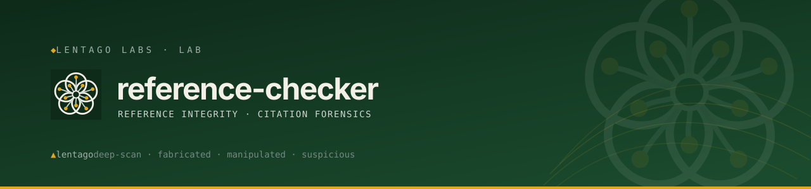

<!-- Lentago Labs brand header — generated by lentago/.github → brand/generate.py.
     Regenerate there; do not hand-edit the banner or badge URLs. -->
<a href="https://lentago.dev"></a>

[](https://github.com/lentago/reference-checker/actions) [](https://github.com/lentago/reference-checker/blob/main/LICENSE) [](https://deepwiki.com/lentago/reference-checker)

  

# Forensic Reference-Integrity Auditor


A prompt-engineered deep-scan verification system for academic reference lists. Built for managing editors in nursing and health sciences publishing who need to catch fabricated, manipulated, and suspicious citations before they reach print.

**Authorship:** The prompts, documentation, and test sets in this repo are co-written with [Claude](https://claude.ai) (Anthropic). I direct the work and review the output; Claude writes the prompts. I'm an infrastructure operator, not a software engineer — please don't read this repo as a portfolio of coding ability.

## 📚 Ask this codebase (DeepWiki)

<a href="https://deepwiki.com/lentago/reference-checker"></a>

[DeepWiki](https://deepwiki.com/lentago/reference-checker) maintains an AI-generated wiki over this
repository — architecture pages, diagrams, and a Q&A box grounded in the actual code. Every
public Lentago Labs repo is indexed ([deepwiki.com/lentago](https://deepwiki.com/lentago));
it is the fastest way to orient before reading source. It is AI-generated: trust it to orient
you, verify against the code before you act on it.

**Good first questions:**
- What does Heuristic 10 (journal legitimacy) check and which sources corroborate a predatory-venue flag?
- What is the required process for shipping a new prompt version, e.g. v7-auditor.md, per repo convention?
- What's the difference in purpose between test-sets/adversarial-30.md and test-sets/real-articles/, and how do baseline PRs use both?

## 🧭 What this repo demonstrates

There's no application code here — the "product" is a single versioned prompt. That constraint
turns out to be a clean way to see prompt-as-code and everyday operations discipline without
any of it being obscured by application logic.

| Pattern | How it shows up here |
|---|---|
| Prompt-as-code versioning | [`prompts/v3-auditor.md`](prompts/v3-auditor.md) … [`v6-auditor.md`](prompts/v6-auditor.md) — [CLAUDE.md](CLAUDE.md) requires every revision to ship as a new `prompts/v<next>-auditor.md` file, never an in-place edit |
| Eval / regression-gate discipline before promoting a change | [`test-sets/adversarial-30.md`](test-sets/adversarial-30.md) (detection) + [`test-sets/real-articles/`](test-sets/real-articles/) (false-positive check), scored and committed to `reports/` in PR [#46](https://github.com/lentago/reference-checker/pull/46) before v6 shipped |
| Thin reusable-workflow wrappers from a central repo | [`.github/workflows/docs-check.yml`](.github/workflows/docs-check.yml), `claude-code-review.yml`, `claude.yml` all `uses: lentago/shared-workflows/.github/workflows/*.yml@main` — CI logic lives once, this repo just declares which checks it consumes |
| Required status check enforced via branch ruleset | `main` requires the `docs-check/docs-check` check to pass, squash-merge only — the wrapper itself shipped in PR [#52](https://github.com/lentago/reference-checker/pull/52) |
| Issue-linked, traceable roadmap | Every shipped heuristic in the [Roadmap](#roadmap) links its originating issue, e.g. Heuristic 9 → [#6](https://github.com/lentago/reference-checker/issues/6), Heuristic 10 → [#7](https://github.com/lentago/reference-checker/issues/7) |
| Generated brand header, not hand-maintained | The banner comment at the top of this file — generated by `lentago/.github` → `brand/generate.py`, shipped in PR [#51](https://github.com/lentago/reference-checker/pull/51) |
| Codified-but-disabled automation, not silently deleted | [`claude-code-review.yml`](.github/workflows/claude-code-review.yml)'s trigger was flipped to `workflow_dispatch`-only with a dated comment explaining why and how to re-enable, in PR [#47](https://github.com/lentago/reference-checker/pull/47) |
| Explicit AI-authorship disclosure | The Authorship note above, and [Credits](#credits) at the bottom |

## 🛠️ Make a change yourself

This is a lab — the systems are real, the stakes are not. Pick a vector. Opening a PR doesn't
require org membership (fork it and propose the change); merging on `main` is reserved for
Lentago Labs members.

**Ship a new prompt version with an eval baseline.** Add `prompts/v<N>-auditor.md` as a new
file — never edit the live version in place — open a PR, and let `docs-check` run as the
required status check. Once that merges, open a companion PR that runs the new prompt against
`test-sets/adversarial-30.md` (detection) and `test-sets/real-articles/` (false-positive check),
committing the resulting HTML reports plus a metrics verdict to `reports/`.

**Proof this works:**
- PR [#44](https://github.com/lentago/reference-checker/pull/44) — feat(prompt): v6 auditor — journal legitimacy (H10) and scoring formula fix
- PR [#46](https://github.com/lentago/reference-checker/pull/46) — feat(baseline): v6 production baseline — H10 functional check, regression gate, scoring calibration

**Adopt a fleet-standard required CI check.** Drop a thin workflow file into
`.github/workflows/` that does `uses: lentago/shared-workflows/.github/workflows/<name>.yml@main`.
Open a PR, get it merged, and the org branch ruleset on `main` treats that workflow's check-run
context as a required status check gating future merges.

**Proof this works:**
- PR [#52](https://github.com/lentago/reference-checker/pull/52) — Adopt the shared docs-check workflow

**Toggle an automated-agent capability off without deleting it.** Flip a reusable workflow's
trigger (e.g. `on: pull_request` → `on: workflow_dispatch`) to pause fleet-wide automation for
this repo while preserving the repo-specific config for a future re-enable — document the change
inline with a dated comment so the next person knows why it's off and how to turn it back on.

**Proof this works:**
- PR [#47](https://github.com/lentago/reference-checker/pull/47) — Disable automated Claude PR review (manual-only trigger)

## The Problem

Academic reference lists are a trust surface. Paper mills, AI-generated citations, and increasingly sophisticated metadata manipulation mean that a reference can *look* perfectly formatted while being completely fabricated — or worse, a composite of real elements assembled to resist casual verification.

Existing tools address slices of this problem:

| Tool | What It Does | What It Misses |
|---|---|---|
| **Edifix** | Formatting correction, DOI lookup | No adversarial verification |
| **Scite.ai** | Citation context analysis | Doesn't detect fabricated metadata |
| **iThenticate** | Text similarity / plagiarism | Ignores reference list integrity |
| **Papermill Alarm** | Paper mill pattern detection | Narrow heuristic scope |
| **RefChecker** | Basic DOI/metadata validation | No forensic depth |

None of them perform adversarial forensic verification across multiple heuristic dimensions simultaneously. That's what this tool does.

## How It Works

The auditor runs as a structured prompt on Anthropic's Claude (Opus), using live web search to verify every citation against authoritative sources:

- **Crossref** — DOI resolution, metadata matching, retraction status
- **PubMed / PMC** — Biomedical citation verification
- **Retraction Watch** — Known retraction and expression-of-concern database
- **Publisher sites** — Direct verification against journal archives

### Forensic Heuristics (v6)

Each reference is evaluated against ten forensic heuristics designed to catch progressively more sophisticated fabrication:

| # | Heuristic | What It Catches |
|---|---|---|
| 1 | **DOI Resolution** | Dead DOIs, DOIs pointing to wrong papers, fabricated DOI patterns |
| 2 | **Homoglyph Detection** | Cyrillic or other Unicode substitutions in titles, author names, or journal names designed to defeat string matching |
| 3 | **Digit-Swap Analysis** | Transposed volume/issue/page numbers that make a real citation unfindable |
| 4 | **Author-Shifting** | Subtly rearranged, added, or removed authors compared to the actual publication record |
| 5 | **Double-Real Trap** | Real DOI + real-sounding metadata from a *different* paper, creating a composite that passes surface checks |
| 6 | **Journal Mutation** | Slightly altered journal titles (word substitution, abbreviation manipulation) that point to nonexistent or different journals |
| 7 | **Shadow-Paper Signatures** | Citations with plausible metadata that match no known publication — fully fabricated but constructed to look legitimate |
| 8 | **Sneaked Reference** | References present in the list but never cited in the manuscript body — reference-list padding designed to inflate the apparent evidence base. **Mode B (full manuscript) only**; skipped in Mode A (reference list only). |
| 9 | **Temporal Impossibility** | Citations dated before the journal's founding year, after the manuscript's submission date (without ahead-of-print/preprint confirmation), or citing a volume/issue number that cannot have existed for the stated year. ([#6](../../issues/6)) |
| 10 | **Journal Legitimacy** | Journals not indexed in DOAJ, PubMed, Scopus, or Web of Science while claiming peer-reviewed status — corroborated by community predatory-venue lists. Flags Elevated in isolation; escalates to High when combined with another heuristic trigger. ([#7](../../issues/7)) |

### Risk Classification

Every reference receives one of four risk tiers:

| Tier | Label | Meaning |
|---|---|---|
| **H** | High | Strong evidence of fabrication or manipulation. Recommend rejection or author query. |
| **E** | Elevated | Multiple anomalies detected. Requires manual verification before acceptance. |
| **M** | Moderate | Minor anomalies or incomplete verification. Flag for editorial awareness. |
| **D** | Defensible | Verified or consistent with known publication records. No action required. |

### Scoring Formula

```
Reference List Score = 100 − (H × 12) − (E × 5) − (M × 2)
```

A fully-clean reference list of any length scores 100. The weights punish fabrication heavily while avoiding over-penalization of grey literature (government reports, organizational white papers, URLs) that legitimately lacks DOIs. Defensible (verified clean) references incur no penalty, so a large clean article correctly scores at its maximum rather than being penalized for length. The Executive Dashboard also displays % Defensible as a complementary integrity signal.

## Output

The auditor produces a self-contained HTML report with six sections, designed for editorial decision-making:

1. **Executive Dashboard** — Confidence gauge (0–100), risk-tier heatmap, summary stat cards. A managing editor can glance at this and know whether to worry.
2. **Forensic Audit Table** — Per-reference findings with heuristic flags, verification sources consulted, and risk tier assignments.
3. **Ranked Suspicion Index** — References ordered by risk severity. Highest-risk citations surface first.
4. **Cleaned APA Reference List** — Corrected formatting for all verified references (APA 7th edition).
5. **PRISMA-Style Flow Diagram** — Visual representation of how references moved through the verification pipeline (verified, flagged, unresolvable, grey literature).
6. **Forensic Appendix** — Methodology documentation, heuristic definitions, and scoring explanation. Supports editorial audit trails and COPE-aligned documentation.

## Usage

### Requirements

- Anthropic Claude (Opus recommended for forensic interpretation quality)
- Web search enabled (the auditor performs live verification against external sources)

### Running an Audit

1. Provide the prompt (see `prompts/v6-auditor.md`) to Claude with web search enabled.
2. Paste or upload the reference list — raw text, extracted from a manuscript PDF/Word document, or mixed formats; the auditor normalizes during processing.
3. The auditor will systematically verify each reference and produce the HTML report.

> **Note:** A single audit of 25–40 references typically requires 5–15 minutes of processing time and significant tool-call volume. This is by design — thorough forensic verification is not a quick-check operation.

## Testing

The system has been validated against two purpose-built corpora — see
[`test-sets/adversarial-30.md`](test-sets/adversarial-30.md) and
[`test-sets/real-articles/`](test-sets/real-articles/) for the raw sets, and the eval /
regression-gate row above for how they gate a prompt promotion.

**Adversarial test set** — 30 references with layered traps: homoglyph substitutions (Cyrillic characters in journal titles), author-shifted citations, shadow papers, Double-Real composites, pop-culture junk citations (including a fabricated Obi-Wan Kenobi publication), and clean references seeded throughout to test false-positive rates.

**Real published articles** — Multiple real articles from JOGNN, MCN, and related nursing journals, verified to confirm the auditor classifies legitimate references as Defensible without over-flagging.

## Roadmap

### Shipped in v6
- **Journal legitimacy and predatory-venue flagging** — Heuristic 10: hybrid whitelist-plus-community-list approach. Primary positive signals: DOAJ, PubMed/MEDLINE, Scopus, Web of Science. Secondary corroboration: Beall's archived list, Stop Predatory Journals. Flags Elevated in isolation; escalates to High when combined with another heuristic trigger. Factual, non-accusatory classification language: never "predatory" as a verdict, at most "potentially predatory" or "unverified venue." Dedicated test set at `test-sets/predatory-venues.md`. ([#7](../../issues/7))
- **Scoring formula fix** — Removed the D × 3 base cost; new formula is `Score = 100 − (H × 12) − (E × 5) − (M × 2)`. A clean reference list of any length now scores 100; scores are not directly comparable to v4/v5 baselines. % Defensible added as a prominent complementary signal in the Executive Dashboard. ([#43](../../issues/43))

### Shipped in v5
- **Temporal impossibility checks** — Heuristic 9: citations dated before the journal's founding year, after the manuscript's submission date (with ahead-of-print/preprint exception), or citing a volume/issue that cannot have existed for the stated year. Dedicated test set at `test-sets/temporal-impossibility.md`. ([#6](../../issues/6))
- **COPE flowchart alignment** — Fully mapped. Structured mapping from risk tier to five specific COPE flowcharts (suspected fabricated data in submitted manuscript, suspected fabricated data in published article, authorship disputes, suspected ghost/gift/guest authorship, suspected redundant publication), with three escalation levels (author query, editorial investigation, publisher/institution notification). ([#9](../../issues/9))

### Shipped in v4
- **Sneaked-reference detection** — References present in the list but never cited in the manuscript body (Mode B / full manuscript). Shipped as Heuristic 8. ([#5](../../issues/5))
- **COPE alignment note** — *Partially shipped in v4; fully mapped in v5.* A single H-tier COPE note appeared in the v4 Forensic Appendix; expanded to full structured mapping in v5.

### Planned
- **Crossref Retraction API integration** — Direct programmatic retraction checking in place of web-search fallback. ([#8](../../issues/8))
- **Batch-pattern detection** — Statistical analysis across multiple submissions to identify coordinated fabrication campaigns. ([#10](../../issues/10))
- **Pipeline decomposition** — Multi-model API pipeline (Haiku → Sonnet → Opus) for cost optimization at editorial scale. ([#11](../../issues/11))

### Architecture (Planned)
Pipeline decomposition across model tiers for cost optimization at editorial scale — see [#11](../../issues/11):

| Stage | Model | Role |
|---|---|---|
| Forensic interpretation | Opus | Judgment calls, ambiguous cases, adversarial reasoning |
| Procedural verification | Sonnet | DOI resolution, metadata matching, systematic checks |
| Formatting and output | Haiku | APA correction, HTML report generation, structured output |

## Project Context

This project originated from a real editorial workflow need. I spoke with a managing editor at a few leading nursing journals. They were clear: these journals face the same reference-integrity threats as all academic publishing, amplified by the rapid growth of AI-generated content and paper mill sophistication.

The tool is designed to fit into a managing editor's actual workflow: receive a manuscript, run the reference list through the auditor, get a report that supports an editorial decision. Not a research tool — an editorial operations tool.

## Development Methodology

This project uses **imperative-to-declarative promotion** as its core development methodology:

1. **Exploratory run** — Execute the prompt, observe what Claude produces, optimize for good raw output.
2. **Identify what works** — Name the specific behaviors, heuristics, and output patterns that succeeded.
3. **Codify into spec** — Write the successful behavior into the prompt as declarative instructions that any Claude instance can reproduce cold.

This is the same pattern as writing configuration management (Puppet, Ansible) from a hand-tuned known-good state: get the system working by hand, then capture that state as code.

Nothing gets added to the spec until it's been tested. The prompt is the artifact.

**Architecture decisions:** [`docs/adr/`](docs/adr/) records the reconstructed rationale behind this repo's key structural choices — prompt-as-product, paired evaluation gates, and the risk-classification scheme.

## Repository Structure

```
├── README.md
├── prompts/
│   ├── v6-auditor.md          # Current production prompt
│   ├── v5-auditor.md          # Previous version, retained for diffing
│   └── v4-auditor.md          # v4, retained for historical comparison
├── test-sets/
│   ├── adversarial-30.md          # 30-reference adversarial set with layered traps
│   ├── temporal-impossibility.md  # 4-reference set targeting Heuristic 9
│   ├── predatory-venues.md        # 5-reference set targeting Heuristic 10
│   └── real-articles/             # Real article reference lists used for validation
├── reports/                   # Sample output reports
├── docs/
│   ├── heuristics.md          # Detailed heuristic documentation (all 10 heuristics + scoring + COPE mapping)
│   ├── competitive-landscape.md
│   └── architecture.md        # Pipeline decomposition design
└── roadmap/
    └── v4-features.md         # Feature tracking (predatory journal flagging and scoring fix shipped in v6)
```

## License

MIT License — see [LICENSE](LICENSE).

## Credits

See the Authorship note at the top — the prompts in this repo are co-written with [Claude](https://claude.ai) (Anthropic). Chris Pitzi directs the work, brings the editorial and ops context, and reviews the output; Claude writes the prompt text.

---

🌱 **Lentago Labs** is a team learning lab — real systems, non-critical stakes, modern
operations patterns demonstrated in the open. Start at the
[org profile](https://github.com/lentago), and read this repo on
[DeepWiki](https://deepwiki.com/lentago/reference-checker).
